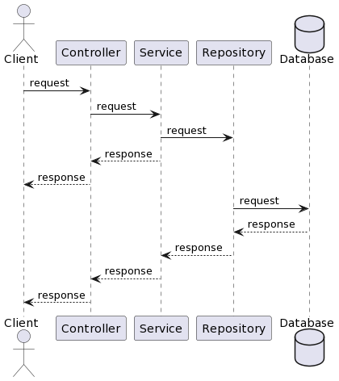
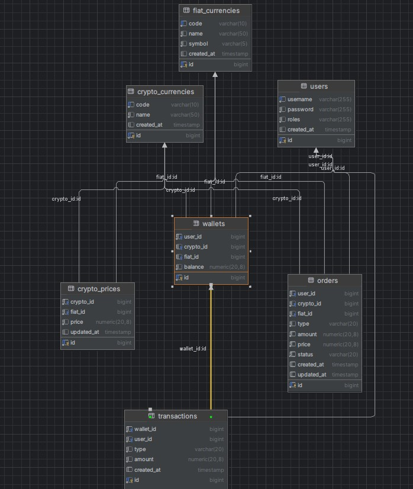

# BasicCryptocurrencyExchangeSystem
This API allows customers to create a wallet with their cryptocurrency and 

___
# Sequence diagram
This how would work application:

1. The client sends request to the Controller, which resend request to a service.
2. Service get request and resend to the Repository.
3. Repository sends request to the Database
4. The database processed the request and sent back.
___

# Table diagrams
Structure application on DB:

We have several classes - User, Wallet, Order and Transaction

The user table representation of user in this application. User can register and also pass authenticated process. 

The wallet table represents currencies, which have user on application.

The Transaction allows user to despite/withdraw currencies

The Order allows user to exchange the currencies between themselves.

___

# Environments

To run this application you need to create `.env` file in root directory with next environments:
* `POSTGRES_HOST` - host of Postgresql database
* `POSTGRES_PORT` - port of Postgresql database
* `POSTGRES_USERNAME` - username for Postgresql database
* `POSTGRES_PASSWORD` - password for Postgresql database
* `POSTGRES_DATABASE` - name of Postgresql database
* `POSTGRES_SCHEMA` - name of Postgresql schema

___

# How to work for this application
1. You need to have Docker Engine and Docker Compose on your machine (or Docker Desktop).
2. Add `.env` file in application directory and wrote all above environments with variable.
3. After you finish the 1st and 2nd points you can download this application and do "docker compose up" in the application directory.
4. Then you can check all application endpoints on swagger(http://localhost:8080/swagger-ui/index.html).
5. The post method "/users/register" endpoint create a user for application with the next parameters: username, password and wallets.
6. The post method "/users/auth" endpoint allows us to get token for passing authentication process. The request need username and password.
7. The post method "/users/refresh" endpoint allows us to refresh token for passing authentication process. Need a refresh token.
8. The post method "/users/wallets" endpoint create a wallet with currency.
9. The get method "/users/wallets" endpoint get all wallets that user have.
10. The post method "/transactions/{userId}/despite" endpoint deposit the currency to wallet. Need two parameter: currencyCode and amount.
11. The post method "/transactions/{userId}/withdraw" endpoint withdraw the currency to wallet. Need two parameter: currencyCode and amount.
12. The post method "/orders/{userId}/create" endpoint allows to create a order for buy/sell currency. Need several parameters: currencyCode, fiatCode, amount and price.
13. The get method "/orders/{orderId}" endpoint allows to get info about status order.
14. The get method "/order-matching/match/{orderId}" endpoint allows to run order-matching manually.
15. After you finish the job, press "CTRL+C" for stopping docker container.

Also, I add a json file to Postman app([PostmanCollectionEndPoints.json](CryptoCurrency.postman_collection.json)). If you don't like the swagger you can use Postman for this target.

